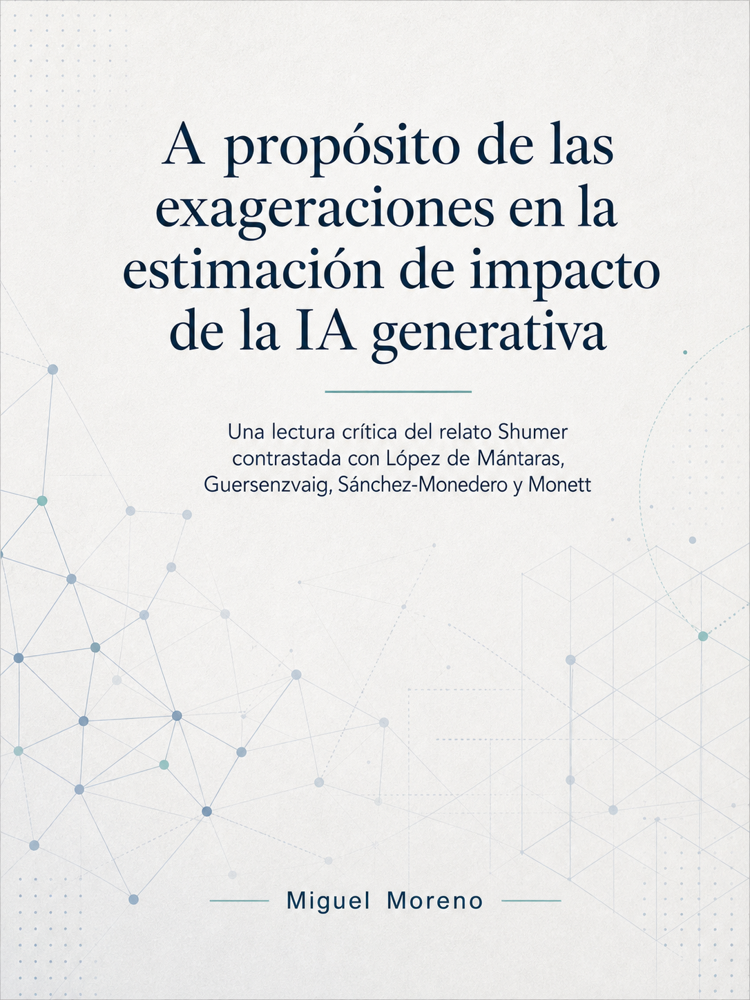

# Shumeria

> *A propósito de las exageraciones en la estimación de impacto de la inteligencia artificial generativa*

[](https://creativecommons.org/licenses/by-nc-sa/4.0/)
[](https://quarto.org/)
<a href="https://doi.org/10.5281/zenodo.20374641"></a>
[](https://shumeria.vercel.app/)
[](https://shumeria.netlify.app/)

<details>
<summary><strong>Ver portada</strong></summary>
<br>
<p align="center">
  
</p>
</details>

---

## Resumen

Ensayo crítico sobre tres textos publicados entre el 9 y el 19 de febrero de 2026: *Something Big Is Happening* de Matt Shumer, la réplica de Ramon López de Mántaras (CSIC) y el artículo de Guersenzvaig, Sánchez-Monedero y Monett. El análisis distingue tres planos que la discusión pública tiende a confundir —demostración individual, tendencia agregada y función política del discurso de inminencia— bajo el marco del *realismo responsable* (Guersenzvaig & Monett, 2026). Incluye una simulación Monte Carlo del horizonte METR con bandas de incertidumbre Wegner-ajustadas.

## Formatos

| Archivo | Naturaleza | Disponible en |
|---|---|---|
| `index.html` | Versión canónica con callouts plegables, navegación interna y enlaces activos | Este repositorio + despliegues |
| PDF | Copia impresa del HTML canónico, sin componentes interactivos | [Zenodo](https://doi.org/10.5281/zenodo.20374641) |

Ambos formatos comparten DOI y son referencialmente equivalentes; para lectura se recomienda el HTML.

## Despliegues

| Plataforma | URL |
|---|---|
| Vercel | <https://shumeria.vercel.app/> |
| Netlify | <https://shumeria.netlify.app/> |
| Repositorio fuente | <https://github.com/utilizas/shumeria> |

## Reproducción

Documento producido con [Quarto](https://quarto.org/). Para regenerar localmente:

```bash
git clone https://github.com/utilizas/shumeria.git
cd shumeria
quarto render shumer_ensayo.qmd --to html
quarto render shumer_ensayo.qmd --to pdf
```

Fuentes bibliográficas en `references.bib`. Configuración mínima por preferencia explícita: sin `_quarto.yml` ni archivos de configuración de plataforma, dependencia en *defaults* de Quarto y de cada servicio de despliegue.

## Procedimiento de elaboración

El ensayo declara explícitamente, en su propia nota metodológica, el uso de asistencia de modelo de lenguaje frontera (Claude Opus 4.7, Anthropic) para tareas de verificación bibliográfica, análisis de ubicación estructural, refinado lingüístico y auditoría de coherencia. Tesis, estructura argumentativa, lectura crítica de las fuentes primarias y todas las decisiones editoriales son de responsabilidad autoral exclusiva.

## Cita

> Moreno-Muñoz, M. (2026). *A propósito de las exageraciones en la estimación de impacto de la inteligencia artificial generativa. Una lectura crítica del relato Shumer contrastada con López de Mántaras, Guersenzvaig, Sánchez-Monedero y Monett* (v1). Zenodo. https://doi.org/10.5281/zenodo.20374641

## Trabajo relacionado

Este ensayo opera como apéndice crítico de un trabajo previo del mismo autor, centrado en el análisis cuantitativo de tendencias y proyecciones de empleo:

> Moreno-Muñoz, M. (2026). *Impacto laboral de los servicios de IA generativa y agéntica. Análisis sobre nichos de empleo masivo (2025–2031)*. Zenodo. https://doi.org/10.5281/zenodo.18548486

## Licencia

[](https://creativecommons.org/licenses/by-nc-sa/4.0/)

Esta obra se distribuye bajo licencia [Creative Commons Atribución-NoComercial-CompartirIgual 4.0 Internacional (CC BY-NC-SA 4.0)](https://creativecommons.org/licenses/by-nc-sa/4.0/).

Se permite copiar, redistribuir y adaptar la obra con atribución, sin uso comercial y bajo la misma licencia. Las citas académicas con atribución completa no requieren permiso adicional.
